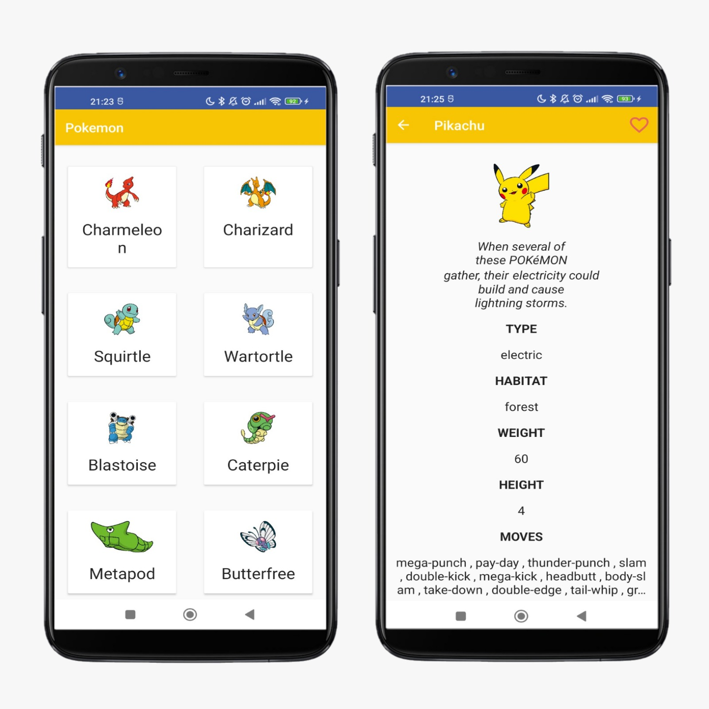
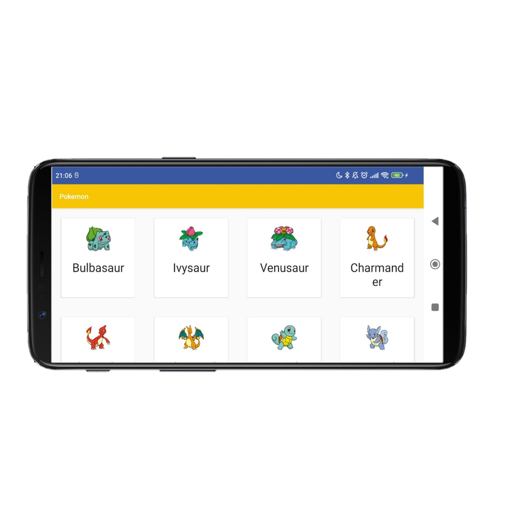
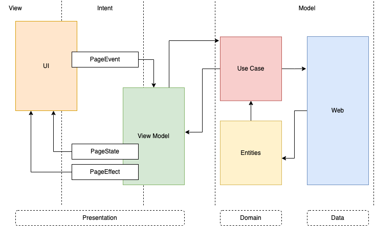

# Pokemon

This is a demo app that shows some pokemons provided by [pokeapi.co](https://pokeapi.co/)

Portrait            |  Landscape
:-------------------------:|:-------------------------:
 |   

## Features

### • Grid

There is a grid with pokemons

The user can scroll down to load more pokemons

### • Details

There are pokemon details

The user comes here after clicking in some pokemon from the previous list

### • Favorites

The user can check or uncheck the favarite

***Disclaimer*** : *At the moment this feature consumes a mock service. So, they always will see this selector unchecked when they enter to details screen and see it checked if click on the heart icon*

### • Screen rotation

Feel free to rotate your device. Our ViewModels is able to recycle information

## Architecture

I opted to use MVI following too the Clean Pattern.
My connection between View and Model layers was done by a ViewModel layer

<i>If you have some doubt about some architecture, please check some articles that I wrote: [Medium](https://medium.com/@andre.ce89/simplifying-android-architectures-for-developers-mvc-mvp-mvvm-clean-mvi-part-1-mvc-4850bfd099c)</i>

## Tests

### • Unit tests
There are some tests for its ViewModels

### • Instrumented tests
There are some UI validates made by [Expresso](https://developer.android.com/training/testing/espresso)

### Main libraries

- [RxJava](https://github.com/ReactiveX/RxJava) : Reactive features
- [Koin](https://github.com/InsertKoinIO/koin) : Dependency injection
- [Retrofit](https://github.com/square/retrofit) : Api Rest
- [Coil](https://github.com/coil-kt/coil) : Image loader
